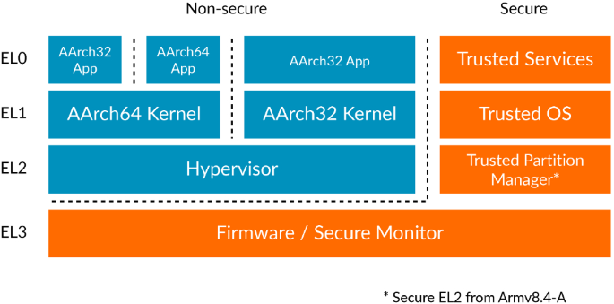

+++
title = 'ARM TrustZone: A Crash Course for Reversers'
date = 2023-09-23
draft = false
+++

## **1. The Role of NS (Non-Secure) Memory Bits**

Each memory page in a system comes with a Non-Secure (NS) bit. The "Normal World" can only access memory with the NS bit set, while the "Secure World" has unrestricted access to both NS and Secure memory. The NS bit is crucial for compartmentalizing secure and non-secure operations. **[Learn more about NS memory.](https://developer.arm.com/documentation/ddi0309/f/Introduction/Security-state--Monitor-mode--and-the-NS-bit)**

## **2. Exception Levels (ELs)**

ARM CPUs utilize four levels of privileges, known as Exception Levels (ELs).

- EL0 is for user-mode tasks.
- EL1 manages the OS kernel.
- EL2 is reserved for the hypervisor.
- EL3 is for the secure monitor.

**[More on Exception Levels and Jumping Between ELs](https://krinkinmu.github.io/2021/01/04/aarch64-exception-levels.html)**

## **3. The Almighty Secure Monitor (SM)**

Think of the Secure Monitor as the god of the system. It has access to everything and acts as the gatekeeper. The system boots in SM mode and then proceeds to load the Trusted OS (TOS), hypervisor, and the regular operating system.

## **4. App Loading and Trusted Apps (TAs)**

Each OS is then responsible for loading its own apps. While we're familiar with standard (NS) apps, there are also Trusted Apps (TAs) that run in the TOS. These TAs are the bread and butter of this tech.

## **5. Who Develops What**

The Secure Monitor, Trusted OS, and usually the hypervisor are developed by the hardware manufacturer due to their close proximity to the hardware. On the other hand, Trusted Apps can be developed by OEMs and are used for various purposes like DRM, key distribution, secure storage, and authentication.

## **6. Secure World Minimalism**

The Secure World runs lean, containing only the necessary code to run TAs. That means that such luxury as e.g. filesystems isn't implemented in the S-World. The more complex functionalities such as user interaction are usually put in the Client Applications (CAs) that run in the Normal World and communicate with TAs.

## **7. Standardized API**

The Global Platform standardizes the APIs for TAs and CAs, and their documentation is freely available. However, this only describes high-level APIs; the nitty-gritty details are vendor-specific. But the docs are still really usefull.

**[TEE Client API Specification](https://globalplatform.org/specs-library/tee-client-api-specification/)**

## **8. Low-Level Communication Between CAs and TAs**

How do CAs communicate with TAs on a low level? CAs talk to the Normal World OS driver, which is usually developed by the hardware vendor. This driver typically accepts the ID of the function a CA wants to execute, along with parameters.

## **9. The SMC Instruction**

The driver then converts these parameters, notably converting pointers to virtual memory into pointers to physical memory. It places converted parameter into CPU registers and executes an SMC (Secure Monitor Call) instruction.

## **10. ARM SMC Calling Convention**

The action of the driver is aligned with the ARM SMC Calling Convention. The X0 register holds the function ID, while X1-X7 contain arguments. Once the SMC is executed, any error codes are returned in X0.

**[ARM SMCCC Full Description](https://developer.arm.com/documentation/den0028/latest)**

## **11. Security Through Privilege Separation**

This is done to protect the system from your playful hands. Otherwise user-mode would be able to abuse the SM and the TOS to modify the  memory belonging to the NS-world's OS kernel.

**[This is know as Boomerang Attack](https://purs3lab.github.io/files/boom.pdf)**

## **12. SMC Instruction and Interrupt Vector Tables**

When an SMC instruction is triggered, an interrupt occurs which is handled accroding to the interrupt vector table set by the Secure Monitor. The base address for this table is stored in VBAR_EL3.

**[AArch64 Vector Table Format](https://developer.arm.com/documentation/100933/0100/AArch64-exception-vector-table)**

## **13. SMC Handling**

SMC calls are either directly handled by the Secure Monitor or passed to the Trusted OS (more often). The TOS then performs the required operations, like spawning a TA, and returns the results.

## **Pro Tips for Reverse Engineering**

Since TrustZone is widely used in Android phones, much of the drivers are open-source and part of the Android Open Source Project (AOSP). Another excellent resource for diving deep is the **[ARM Trusted Firmware](https://github.com/ARM-software/arm-trusted-firmware)**, which is often used as a base for custom Secure Monitors.