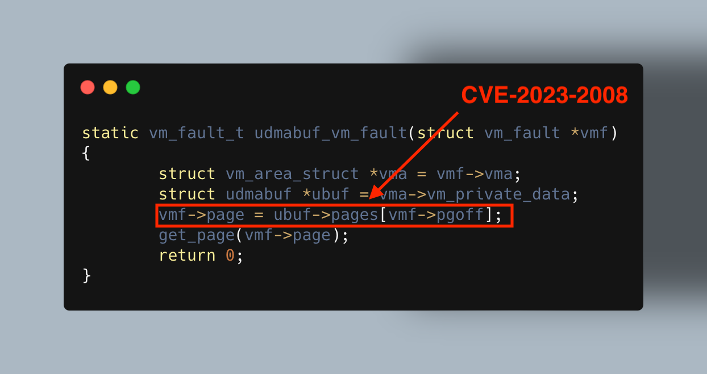

+++
title = 'Linux Kernel Attack Surface: beyond IOCTL. DMA-BUF'
date = 2024-12-26
draft = false

+++



When analyzing Linux kernel module code, I often look for instances of `copy_from_user` or jump straight to the IOCTL handler. This is a valid approach; however, I have always wondered if there’s more to it—whether a kernel module without any `copy_from_user` calls could still have an attack surface reachable from user mode. And the answer is yes.

In this post, we will discuss the Linux kernel module attack surface that doesn’t involve a single `copy_from_user`, using DMA buffer drivers as an example. Hopefully, in future posts in this series, we will analyze other subsystems.

## The Usual Suspects

But first, let’s address the usual attack surfaces that could be considered trivial:

- IOCTL handlers: Probably the most popular way of implementing a communication channel with user space. These can be found by locating the handler in the `file_operations` structure (a pointer to the structure is usually an argument to the `cdev_init` function) or by searching for something like "ioctl" in the function list.
- Handlers for `procfs`, `sysfs`, and `debugfs` entries: For example, handlers for `procfs` operations are usually contained within the `proc_create` structure, which is used as an argument for the `proc_create` function.
- `copy_from_user`: This is used to copy data from user-space memory to kernel-space memory, ensuring that the kernel doesn’t directly access potentially invalid or malicious user-space pointers. As mentioned earlier, going through the list of usages of this function is a good way to analyze a module. All the usual suspects above use `copy_from_user`.

## DMA-BUF

The **DMA-BUF (Direct Memory Access Buffer)** is a Linux kernel framework designed to efficiently share memory buffers across different devices and subsystems. It allows buffers backed by physical memory to be shared seamlessly. For example:

1. A user-mode program or driver allocates a buffer containing graphical information to perform rendering.
2. The buffer is passed to the GPU driver.
3. After rendering is complete, the same buffer holds the result, which the client can then display on the screen.

As DMA buffers are often used with devices and/or to pass data between code running with different privileges (e.g. to/from a hypervisor, Secure Monitor, etc.), you can often find proprietary, vendor-specific implementations created for particular devices.

Creating a DMA-BUF to be used by other modules and user-mode applications is called *exporting*. An exporter kernel module must create a communication interface (which can be an IOCTL-based, implementation-specific interface) and implement [`struct dma_buf_ops`](https://docs.kernel.org/driver-api/dma-buf.html#c.dma_buf_ops) for the buffer.

Let's take a look at the structure:

```c
struct dma_buf_ops {
    bool cache_sgt_mapping;
    int (*attach)(struct dma_buf *, struct dma_buf_attachment *);
    void (*detach)(struct dma_buf *, struct dma_buf_attachment *);
    int (*pin)(struct dma_buf_attachment *attach);
    void (*unpin)(struct dma_buf_attachment *attach);
    struct sg_table * (*map_dma_buf)(struct dma_buf_attachment *, enum dma_data_direction);
    void (*unmap_dma_buf)(struct dma_buf_attachment *,struct sg_table *, enum dma_data_direction);
    void (*release)(struct dma_buf *);
    int (*begin_cpu_access)(struct dma_buf *, enum dma_data_direction);
    int (*end_cpu_access)(struct dma_buf *, enum dma_data_direction);
    int (*mmap)(struct dma_buf *, struct vm_area_struct *vma);
    int (*vmap)(struct dma_buf *dmabuf, struct iosys_map *map);
    void (*vunmap)(struct dma_buf *dmabuf, struct iosys_map *map);
};
```

Callbacks in the structure are executed when various actions are performed on the buffer.

The most interesting callback is, of course, `mmap`, which is triggered when userspace executes the corresponding syscall. The callback's task is to perform all the necessary operations to memory-map the buffer and fill the [vma structure](https://elixir.bootlin.com/linux/v6.12.1/source/include/linux/mm_types.h#L667). What’s particularly interesting is that the exporter can define its own implementation of [struct vm_operations_struct](https://github.com/torvalds/linux/blob/master/include/linux/mm.h#L610):

```c
vma->vm_ops = &vm_operations;
```

This also represents an attack surface. [This blogpost](https://labs.bluefrostsecurity.de/blog/cve-2023-2008.html) from Blue Frost Security  covers a vulnerability in **udmabuf**'s page fault handler, which was the only custom operation in the `vm_operations_struct`:

```c
static const struct vm_operations_struct udmabuf_vm_ops = {
	.fault = udmabuf_vm_fault,
};
```

The root cause was that "`vm_fault->pgoff` was used without verifying whether it was within the bounds of the `pages`array." And the user has control over the page offset!

```c
static vm_fault_t udmabuf_vm_fault(struct vm_fault *vmf) {
  --snip--
    vmf->page = ubuf->pages[vmf->pgoff];
  --snip--
    get_page(vmf->page);
  	return 0;
}
```

In the end, they managed to gain a reference to an arbitrary page, which led to local privilege escalation. And with that, we’ve added another entry to our Linux attack surface list.

## DMA-BUF Heap

DMA-BUF heap is a small Linux subsystem that provides a unified interface for working with DMA-bufs. Each DMA-BUF heap is implemented by a separate kernel module (including default implementations) and has a separate character device.

The kernel subsystem has to implement just one IOCTL: `DMA_HEAP_IOCTL_ALLOC`, which is used—you guessed it—to allocate a DMA-buf. It takes the following structure as an argument:

```c
struct dma_heap_allocation_data {
	__u64 len;
	__u32 fd;
	__u32 fd_flags;
	__u64 heap_flags;
};
```

In the `DMA_HEAP_IOCTL_ALLOC` dispatcher, the kernel calls `dma_heap_buffer_alloc`.

```c
static long dma_heap_ioctl_allocate(struct file *file, void *data)
{
--snip--
	fd = dma_heap_buffer_alloc(heap, heap_allocation->len,
				   heap_allocation->fd_flags,
				   heap_allocation->heap_flags);
```

Which, in turn, invokes the `allocate` callback from the `heap->ops` structure.

```c
static int dma_heap_buffer_alloc(struct dma_heap *heap, size_t len,
				 unsigned int fd_flags,
				 unsigned int heap_flags)
{
	/*
	 * Allocations from all heaps have to begin
	 * and end on page boundaries.
	 */
	len = PAGE_ALIGN(len);
	if (!len)
		return -EINVAL;
	return heap->ops->allocate(heap, len, fd_flags, heap_flags);
}
```

Yep, we’re back to dealing with operations. The `struct dma_heap_ops` contains only one member: `allocate`. This is the function that a kernel module implementing a DMA-buf heap needs to define. The user controls the `len`, `fd_flags`, and `heap_flags` arguments.

```c
struct dma_heap_ops {
	struct dma_buf *(*allocate)(struct dma_heap *heap,
				    unsigned long len,
				    u32 fd_flags,
				    u64 heap_flags);
};
```

This means that the `allocate` operation is also part of the attack surface.

DMA-BUF heaps sometimes include their own DMA-BUF implementations, which can also contain vulnerabilities. For example, [CVE-2024-46852](https://lore.kernel.org/linux-cve-announce/2024092742-CVE-2024-46852-91a5@gregkh/) was an off-by-one in the CMA heap's fault handler. This flaw allowed mappings larger than the buffer size via `mremap`, bypassing overflow checks and potentially leading to unauthorized memory access. 

## Conclusion

The DMA-BUF and DMA-BUF heap attack surface is not huge, but as we’ve seen, it could still be a source of real bugs. And in this day and age, when finding vulnerabilities is becoming increasingly difficult, exploring less obvious attack vectors turns out to be more and more lucrative, but also undeniably fascinating for researchers like us.

