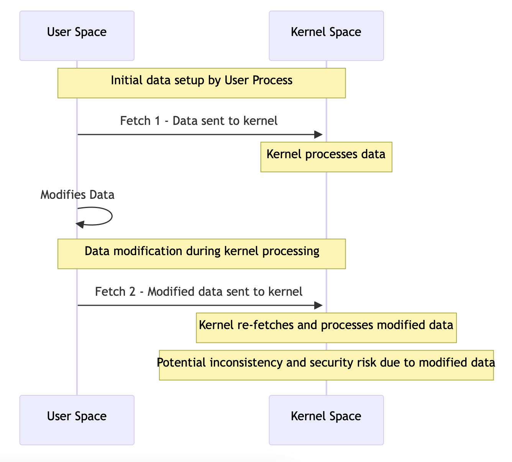
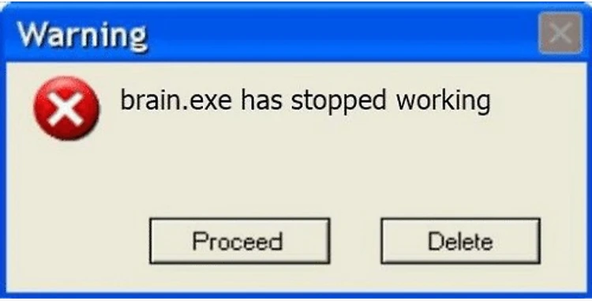
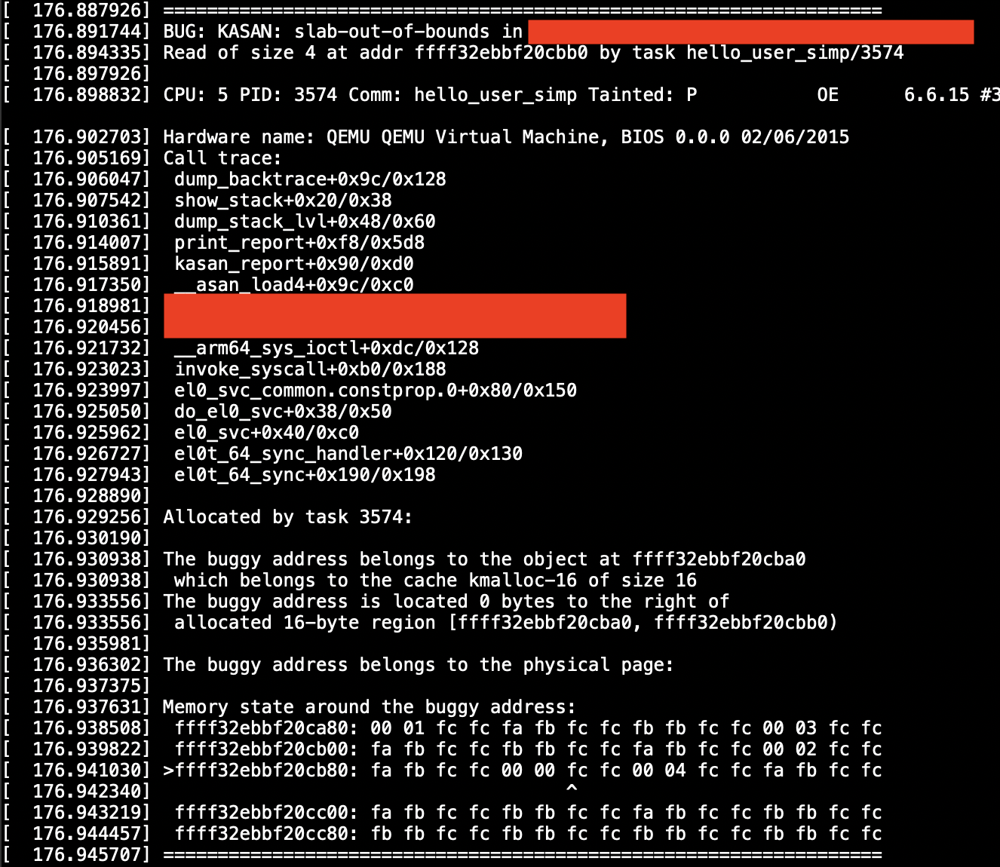

+++
title = "Hunting Bugs in Linux Kernel With KASAN: How to Use it & What's the Benefit?"
date = 2024-09-10
draft = false

+++


It all started when I had brain surgery. After several days in the hospital, I got home. But I guess the surgeon hit something in my brain after all because, at home, I started to feel a strong desire to read Linux kernel module code. I decided to start with a 3rd party module that I use, but its usage is not widespread, making it an easier target.

After just a couple of hours, I found something that looked like a vulnerability. Digging deeper confirmed it—judging by the code, it was possible to trigger kernel memory overread. But that was just a theory. To prove it in practice, I needed to create a PoC.

The vulnerability was nothing crazy, just a double fetch, but the thing is that I had no idea if it was enough to just create two threads to win the race condition or if I should employ some nasty tricks. Well, there was only one way to find out.



I started with a simple PoC that could communicate with the kernel module using the simplest commands. When I successfully got a response, I moved on to creating a PoC for the vulnerability. My expectation was that triggering the bug would crash the system. But when I launched the PoC, nothing happened. I double-checked that the communication with the module was good and the proper branch in the IOCTL handler was triggered. Still, no crash.

Well, it must be that the double fetch happens so quickly that the bug is impossible to trigger without additional tricks. I spent several days looking for those, and let me tell you: people have come up with crazier stuff than I could have possibly imagined. But most of those were already patched, and the rest either didn’t work or my IQ level was too low for them. In the end, I just put it aside, deciding that it was too hard to trigger.



Until a few months later, when I decided to come back with fresh energy and fresh ideas:

1. I could create my own kernel module that resembles my target, add a lot of debug prints, and try to trigger the double fetch.
2. If that works, since the target is open source, I can pull the same trick and add a bunch of debug prints there.
3. Alternatively, I could use Kernel Address Sanitizer (KASAN), a tool built into the kernel designed to catch various memory-related bugs, including those that are harder to catch, like my memory overread.

To be honest, I’d managed to reach my age without ever trying KASAN, so I wasn’t sure how easy it is to use and if it works somewhere other than the developer machine. So I opted for options 1 → 2.

Code-code-code and the training kernel module was ready. Code-code-code and a simple two-threaded PoC was ready too. `./poc && dmesg` showed that it’s all real: debug prints reported that you can trigger the bug after not-so-many tries.

The third code session to add as many debug prints as humanly possible to the target, adapt the PoC, and voila: I could see how `printk()` prints kernel heap metadata. So what was the problem the first time?

It was just a simple mistake: I overlooked a crucial piece of code that essentially placed a limit on how much memory you can read—still enough to read past the buffer boundary, but not enough for the read to crash the kernel.

So why KASAN in the title? It’s simple: after all that nonsense, I decided to try KASAN and it turned out it could save me A LOT of time—days shaved to an hour or two to compile the kernel with KASAN enabled. Also, with KASAN, you get a simple binary answer to whether the behavior you trigger is a vulnerability: yes or no. It’s easy to mess up debug prints or overlook something, but with KASAN the answer is definitive. Let’s dive deeper into that.

KASAN creates so-called shadow memory to keep track of memory reads and writes. Each byte of shadow memory represents 8 bytes of real memory. Byte values 0x00 to 0x07 indicate normal memory that’s legal to access, while negative numbers correspond to special cases, e.g., 0xff - memory that was freed, 0xfc - red zone between allocated buffers, etc.

Then each memory access is instrumented to check if each read or write attempt operates on “legal” memory or is trying to do something nasty.

For more information about KASAN inner workings, feel free to check out these articles:

[KASAN: What is it? How does it work? And what are the strange numbers at the end? — Star Lab Software](https://www.starlab.io/blog/kasan-what-is-it-how-does-it-work-and-what-are-the-strange-numbers-at-the-end)

https://blogs.oracle.com/linux/post/linux-slub-allocator-internals-and-debugging-3#:~:text=KASan uses shadow memory to,bytes of kernel address space.

To make use of KASAN, we have to recompile the kernel. So make sure that you have about 40 GB of free space to store the sources and build artifacts and let’s go.

First, let’s install everything we need for compilation:

```bash
bashCopy code
$ sudo apt update
$ sudo apt install build-essential libncurses-dev bison flex libssl
```

Then let’s download the kernel source code:

```bash
bashCopy code
$ apt source linux-image-$(uname -r)
$ cd linux-*
```

Now we have to edit the kernel configuration to turn on KASAN:

```bash
$ make ARCH=arm64 menuconfig
```

Navigate to **`Kernel hacking -> Memory Debugging`** and enable **`KASAN: runtime memory debugger`**. Choose the type of KASAN that best fits your needs (e.g., generic KASAN).

You can examine your .config to check if KASAN was enabled. This one option was enough for me, but feel free to get crazy and enable more. 

That’s it, start the build and go get a cup of tea or two:

```bash
$ make ARCH=arm64 -j $(nproc)
$ make ARCH=arm64 modules
$ make ARCH=arm64 dtbs
```

The Linux kernel compiles quite nicely for such a huge project, but in my particular case, I encountered this cryptic error:

```bash
  LD [M]  net/hsr/hsr.ko
  LD [M]  net/qrtr/qrtr.ko
  LD [M]  net/qrtr/qrtr-smd.ko
  LD [M]  net/qrtr/qrtr-mhi.ko
make: *** [Makefile:246: __sub-make] Error 2
```

So I resumed the build with just one job to get better error output:

```bash
$ make ARCH=arm64 -j 1
  SYNC    include/generated/autoconf.h
  CALL    scripts/checksyscalls.sh
  DESCEND bpf/resolve_btfids
  INSTALL libsubcmd_headers
  UPD     include/generated/utsversion.h
  CC      init/version-timestamp.o
BTF: .tmp_vmlinux.btf: pahole (pahole) is not available
Failed to generate BTF for vmlinux
Try to disable CONFIG_DEBUG_INFO_BTF
make[2]: *** [scripts/Makefile.vmlinux:37: vmlinux] Error 1
make[1]: *** [/media/sl4v/a6417fe8-1e5e-4957-86d7-0413e50d4dc6/kasan/linux-6.6.15/Makefile:1176: vmlinux] Error 2
make: *** [Makefile:246: __sub-make] Error 2
```

Thankfully, the error message plainly told me what to do, and it worked. I resumed the compilation process, and the rest of the way was smooth:

```bash
$ nano .config
```

After the tea ceremony you had, proceed by installing modules and the kernel itself:

```bash
$ sudo make ARCH=arm64 modules_install
$ sudo make ARCH=arm64 install
```

And finish by updating the bootloader configuration and rebooting:

```bash
$ sudo update-grub
$ sudo reboot
```

Now you should take a careful look at the options you’re offered by the bootloader during boot: you should have one new option—that’s your kernel with KASAN—select it.

The boot should take much more time and memory—that’s the price we have to pay for all the instrumentation and memory tracking KASAN is doing for us. After the boot is finished, verify that you have KASAN enabled:

```bash
$ sudo dmesg | grep -i kasan
```

Phew, I hope you didn’t forget why we came here. Once we have a kernel with KASAN up and running, we can load the target module in question and execute our PoC to get the following output:



KASAN was kind enough to include a shadow memory dump, and we can see that the buggy read was at the address, and the corresponding shadow memory byte is 0xfc—the red zone between kernel buffers. This already tells us what happened: the kernel module tried to read data past the allocated buffer.

So, KASAN is not only very helpful for getting a binary answer on whether a bug is triggered or not, but it also provides an opportunity to debug and find the root cause if the bug was found during fuzzing or similar processes.

### Further reading

[KASAN: What is it? How does it work? And what are the strange numbers at the end? — Star Lab Software](https://www.starlab.io/blog/kasan-what-is-it-how-does-it-work-and-what-are-the-strange-numbers-at-the-end)

[https://blogs.oracle.com/linux/post/linux-slub-allocator-internals-and-debugging-3](https://blogs.oracle.com/linux/post/linux-slub-allocator-internals-and-debugging-3)

[The Kernel Address Sanitizer (KASAN) — The Linux Kernel 5.10.0-rc1+ documentation](https://www.infradead.org/~mchehab/kernel_docs/dev-tools/kasan.html)

[Kernel Address Sanitizer (KASAN) — The Linux Kernel documentation](https://static.lwn.net/kerneldoc/dev-tools/kasan.html)

[Kernel Address Sanitizer (KASAN) | The Fuzzing Project](https://blog.fuzzing-project.org/23-Kernel-Address-Sanitizer-KASAN.html)