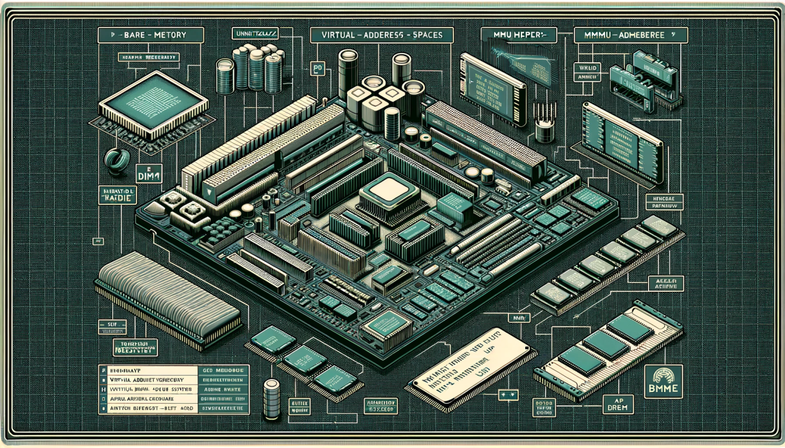
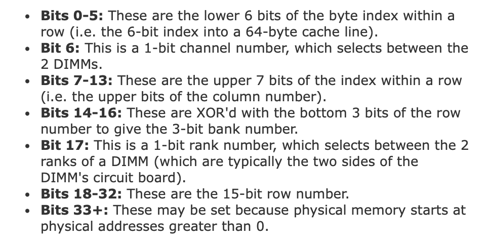
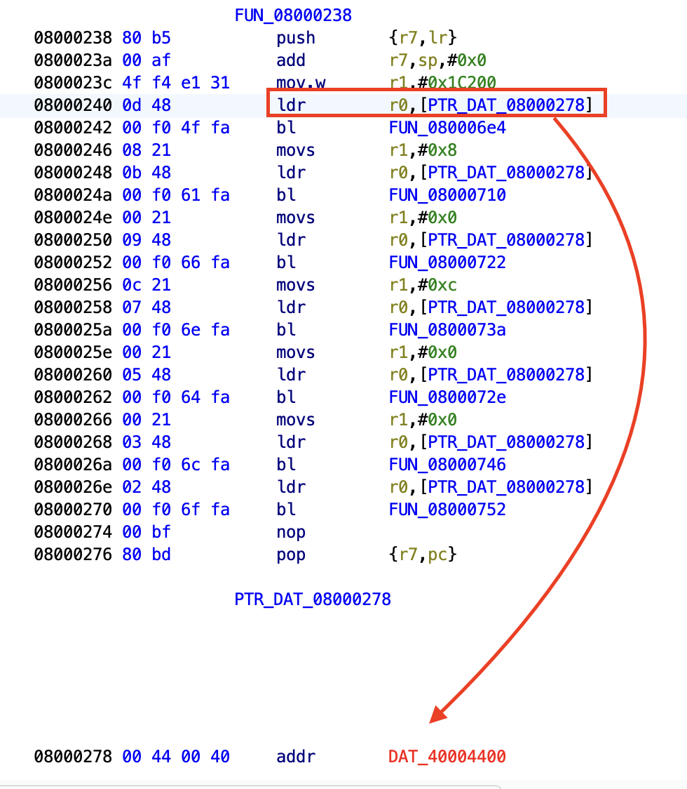
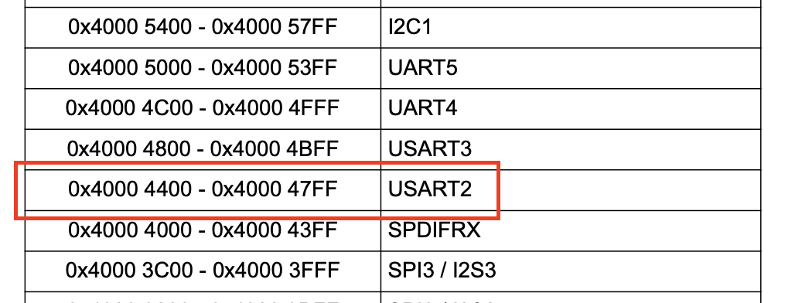
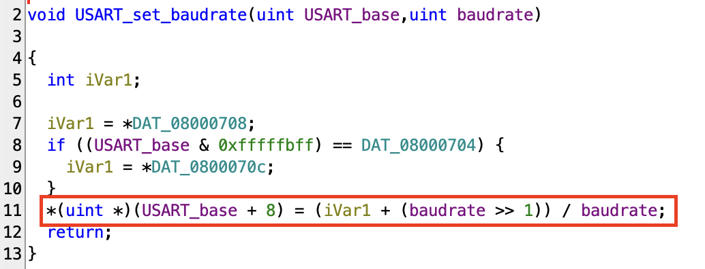

+++
title = 'Bare Metal Reversing: Physical Memory'
date = 2023-12-18
draft = false
+++

When you're dealing with bare metal firmware, you have access to every bit of code: from the very start of the execution to the very end. Among other things, this means that nothing here comes for granted: all of the CPU subsystems are uninitialized, including the Memory Management Unit (MMU). Even more than that - the MMU may never be initialized over the whole time of execution, depending on your target. But what is the role of the MMU? It’s the hardware backend behind virtual memory.

Virtual memory address is a concept many are already familiar with. It provides a unique virtual address space for each process, usually configured and managed by the operating system and the MMU. The MMU is responsible for translating these virtual addresses into physical addresses.

## The Difference Between Virtual and Physical Memory

Every bit of data operated on by an OS or a user-mode program is stored somewhere in physical memory (if not paged out). The OS and the MMU take care of translating virtual into physical addresses using several layers of page tables. So, knowing the virtual address and the tables' format, it’s possible to convert it to a physical address.

The same story with physical addresses: with knowledge of an address and knowing the algorithm the memory controller employs, it’s possible to locate the exact physical location of data on a DRAM chip. A DRAM chip is split into several banks, each split into rows and columns. A DIMM memory stick has two sides (ranks), each can have memory chips on it. And each memory stick belongs to a memory channel.

[Mark Seaborn](http://lackingrhoticity.blogspot.com) played around with [rowhammer PoC](https://github.com/google/rowhammer-test/blob/master/rowhammer_test.cc) to find out the [actual algorithm](http://lackingrhoticity.blogspot.com/2015/05/how-physical-addresses-map-to-rows-and-banks.html) behind the physical address conversion:

 

This is an interesting piece of knowledge, but does it have any practical use for us? Well, the actual physical location of memory bytes is required to know for the above-mentioned rowhammer attack. It also might be useful for something like EMI glitching, although the good old trial and error way might be more practical here. So, in 99.9% of real-life situations, this presents just an interesting piece of background information, unlike our next topic.

## Memory Mapped IO

Considering that the MMU is inactive at the beginning of the execution of a baremetal firmware, you have to keep in mind that the code operates in the physical memory space. For the most part, it doesn’t mean anything special, all the operations proceed like any other memory operations. That’s until you see a weird code like this:

Here, a red-highlighted pointer indicates an address not present in the firmware. “What in the name of God is that?”, you may ask. Well, my God-feared friend, it’s memory-mapped input and output or MMIO, a method CPUs/SoCs/uCs use to expose peripherals to programmers. Since it uses the same instructions as normal memory access, it provides a quick and efficient way to talk with peripherals.

If we’re talking about off-the-shelf chips, you can find the memory mapping in datasheets. The code in the example is for a basic STM32 microcontroller and the [datasheet](https://www.st.com/resource/en/datasheet/stm32f446mc.pdf) can be easily found online.

In the datasheet, the mysterious address is identified as belonging to USART2 (analogous to UART for our discussion). Converting the function's second argument, 0x1C200 from hex to decimal, gives 115200 – the popular UART baud rate. So the function is used to configure USART2's speed.

The function itself converts the baud rate into the units required by the USART controller and writes the result at an offset of 8 from the USART base address. With that, the baud rate is now configured. Other parameters, such as data bits, are configured in a similar manner. Even the actual data characters are written to a different offset from the USART base.

## Further Read/Watch

Mapping of physical addresses to location in DRAM: https://depletionmode.com/ram-mapping.html

MMIO: https://www.youtube.com/watch?v=q4CxE5P6RUE