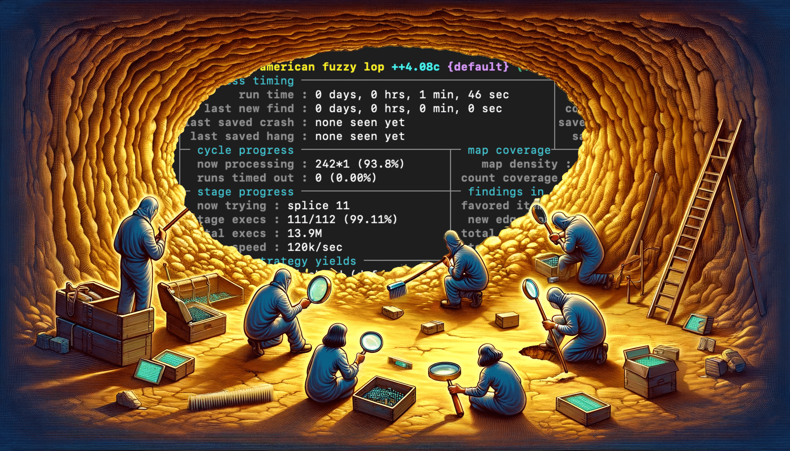
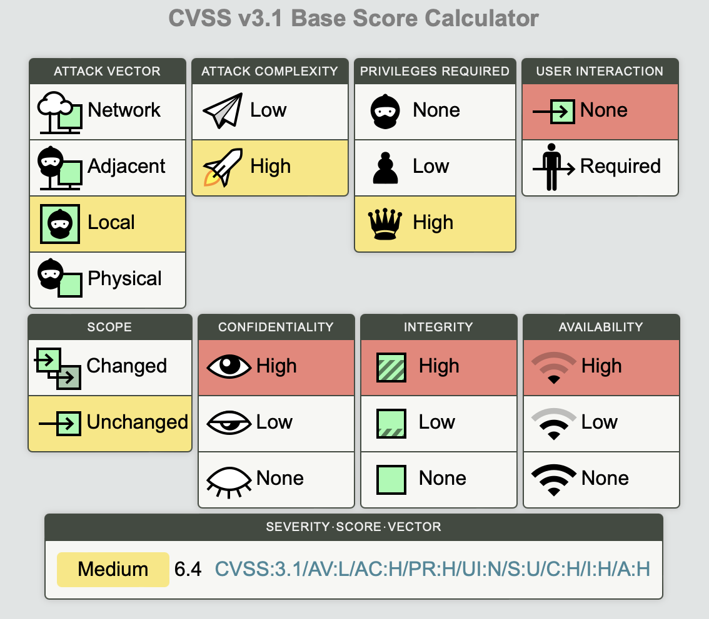
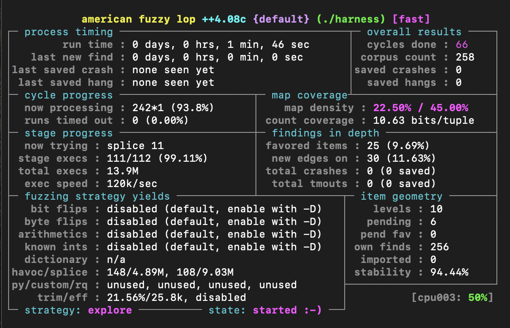
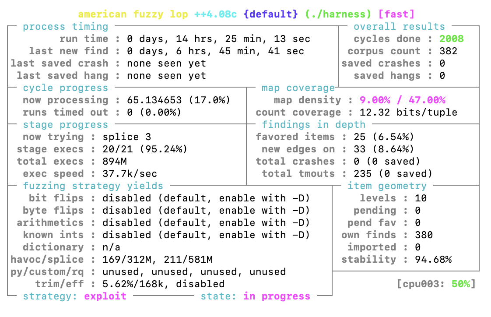

+++
title = 'File Fuzzing: Easy and Really Fast with new AFL++ Features'
date = 2024-01-09
draft = false
+++




One day, I saw that `srelay` exists. It’s a pretty old SOCKS4 and SOCKS5 proxy server with the latest update from 2018. Hand on heart, it's hard to call it popular, but it’s far from being dead either. I also wasn’t able to find any information about the history of srelay vulnerabilities. To top it all off, the code base is really compact, so it sounded like a good opportunity to try out some of AFL++'s new features.

---

## Reconnaissance

After briefly reading the source code, we can split the target’s functionality into several distinct parts that parse user data:

1. Config parsing
2. SOCKS server
3. Proxy client:
    1. SOCKS
    2. HTTP

I would argue that each of these parts needs its own fuzzing harness based on the vastly different data formats they parse:

- The text-based config looks nothing like SOCKS or HTTP requests.
- SOCKS and HTTP are obviously different protocols with request formats that are not alike.
- While the SOCKS client and server operate on a similar protocol, they still expect different types of data to parse. Mixing it would just confuse the fuzzer.

On top of that, splitting the fuzzing campaign into several subcampaigns allows us to isolate pieces of code with different functionalities into their own harnesses, making the whole thing much more manageable.

We can start with fuzzing the config parser. It’s the easiest parser to fuzz in the code: just one neat function `int readconf(FILE *fp)`. Ok, but is a config parser vulnerability cool? Well, it’s not as cool as a vulnerability exploitable over a network, so you might get fewer respect points from the cool kids on the block. But if we calculate the CVSS for a code execution vulnerability that we can trigger, let's say, through a world-writable config file, we’ll get a CVSS score of 6.4 in the worst-case scenario. Not too shabby.



Maybe we’ll cover the rest of the functionality another time, but for now, `readconf` has won a place in my heart and it looks like a good option to try out features all the cool guys are using.

## Desperate times call for desperate measures

Having a function like `int readconf(FILE *fp)` to fuzz is the dream of every master fuzzer. We can follow the beaten path and write a usual AFL harness around the function:

```c
int main(int argc, char *argv[]) {
    FILE *fp = fopen(argv[1], "r");
    int result = readconf(fp);
    fclose(fp);
    return result;
}
```

That’s a good approach and it will work. But what if we want to spice things up and use persistent fuzzing instead of the usual fork server? The fork server mode is self-explanatory: on each fuzzing iteration, a new fork of the target process is started. But in persistent mode, AFL++ will execute our target function in a loop: no forks — more speed, and that’s what we want.

AFL++ has had persistent mode for some time, but implementing a harness for it always felt kind of clumsy, to be honest. Your code is supposed to look like this [according to the docs](https://github.com/AFLplusplus/AFLplusplus/blob/stable/instrumentation/README.persistent_mode.md):

```c
__AFL_FUZZ_INIT();

main() {

#ifdef __AFL_HAVE_MANUAL_CONTROL
  __AFL_INIT();
#endif

  unsigned char *buf = __AFL_FUZZ_TESTCASE_BUF;  // must be after __AFL_INIT
                                                 // and before __AFL_LOOP!
  while (__AFL_LOOP(10000)) {
    int len = __AFL_FUZZ_TESTCASE_LEN;  
    target_function(buf, len);
  }
  return 0;
}
```

This works, but we can do better than that. To find out how, we will have to do the unthinkable — go dig deeper into the docs. And [there](https://aflplus.plus/docs/fuzzing_in_depth/), we find that:

> libfuzzer `LLVMFuzzerTestOneInput()` harnesses are the defacto standard for fuzzing, and they can be used with AFL++ (and honggfuzz) as well!
> 

Great news: on top of better (in my opinion) syntax, we get the ability to use our harness with not one, but three fuzzers for exactly 0 additional cost.

To refresh our memory, a minimal libfuzzer harness is just 4 lines of code:

```c
extern "C" int LLVMFuzzerTestOneInput(const uint8_t *Data, size_t Size) {
  DoSomethingWithData(Data, Size);
  return 0;
}
```

Let’s rewrite it for our case:

```c
// include or copy target function code 
// and everything it needs to work

int LLVMFuzzerTestOneInput(const uint8_t *Data, size_t Size) {
    char tmpfilename[] = "readconf_fuzzXXXXXX";
    FILE *fp = fopen(tmpfilename, "wb");
		fwrite(Data, 1, Size, fp);
		int result = readconf(fp);
    fclose(fp);
    return result;
}
```

We lose `extern "C"` since the code is C, not C++, then write the data buffer to a file and pass the `FILE` pointer to the target function.

But it’s 2024 already and storing files in the filesystem is so out of fashion. And we already get less respect from our friends because of the function we chose to fuzz! Oh yeah, and storing something in the filesystem instead of memory will slow things down.

We could save files in `/tmp`, which is memory-backed, but what if we didn’t have to involve the filesystem at all, thus totally eliminating the middle man. Fuzzing is a game of speed, and doing so will allow us to gain some by not having to wait for the system call execution.

We can achieve this with `fmemopen` — a function from the C standard library that's been there for years, but is still not well known. It allows us to open a memory buffer as a file and returns a `FILE` pointer that's compatible with all file operations. With it, our fuzzing function will look like this, nothing unnecessary, everything stays in memory:

```c
int LLVMFuzzerTestOneInput(const uint8_t *Data, size_t Size) {
    FILE *fp = fmemopen(Data, Size, "r");
    readconf(fp);
    fclose(fp);
    return 0;
}
```

Just 6 lines of code, so concise, but so powerful! No, I’m not crying, you’re!

## Fuzzing

Let’s compile our code:

```bash
afl-clang-fast -fsanitize=fuzzer -o harness harness.c
```

~~After fixing a bunch of C stuff~~ Immediately after, we can start the fuzzer:

```bash
afl-fuzz -i inputs -o outputs ./harness
```



The execution speed is 120,000 runs per second. Really fast, probably too fast to be true. Normally I’d add some logging and investigate the situation. But we introduced a lot of optimizations and compiled the harness using `afl-clang-fast`. There are [reports](https://x9security.com/fuzzing-explained-with-afl/) of persistence mode achieving more or less the same order of speed we have here. On top of that, I used really powerful hardware to run it. So I’d say it’s fine for our learning purposes.

The next morning, we’re presented with this.



Unfortunately for us, no bugs were found. We can also see that `last new find` is more than 6 hours. It means that it's been 6 hours since AFL++ saw a new execution path. Considering that it also cycled through all possible mutations 2008 times, it’s safe to say that we can conclude our fuzzing campaign.

Yes, we don’t have any findings, but maybe the real findings were the things we’ve learned along the way?