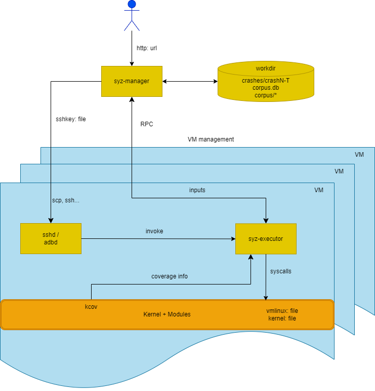

+++
title = 'Finding Bugs in Kernel. Part 1: Crashing a Vulnerable Driver with Syzkaller'
date = 2024-09-17
draft = false

+++


`syzkaller` is one of the best fuzzers for the Linux kernel. It supports coverage (through KCOV) and provides a way to declaratively describe syscalls you want to fuzz. It also highly encourages you to use KASAN (and you can even use more sanitizers supported by the kernel). We got to know KASAN in the [previous post](https://slavamoskvin.com/hunting-bugs-in-linux-kernel-with-kasan-how-to-use-it-whats-the-benefit/) and it's a really good thing that allows you to catch more bugs during fuzzing. 

Linux has around [450 syscalls](https://github.com/torvalds/linux/blob/v6.11-rc6/arch/x86/entry/syscalls/syscall_64.tbl), which at first glance might not seem like a lot of attack surface to fuzz. But actually, the attack surface is huge because those syscalls provide you with communication channels to numerous kernel subsystems. Even the simplest syscall `open` has a different implementation for every filesystem driver, every node under `/dev`, and so on. That's why `syzkaller`'s [system call descriptions](https://github.com/google/syzkaller/tree/master/sys/linux), although vast, still don't cover every last bit of the attack surface.

Another good thing about `syzkaller` is that, unlike a lot of tools out there, it runs not just on the author's machine, but actually, while the setup is not the simplest, it works perfectly out of the box. The docs even tell you how to set up fuzzing not only for x86_64, but also for arm/arm64, riscv64, and s390x.

[](https://github.com/google/syzkaller/blob/master/docs/process_structure.png?raw=true)

That is, if you're using Linux to host fuzzing virtual machines. I, in my typical manner, didn't strive for an easy way out; I wanted to my use macbook to fuzz as it was the most powerful machine in my house and because I simply liked working on it. That was a part of the problem. Another issue was that while `syzkaller` *supports* fuzzing kernel modules, my impression is that it's definetely not the first class citizen and the tool focuses on fuzzing the mainline kernel (at understandably so). In my opinion, third-party kernel modules can present a good target for security research because many of them are not widely adopted and present less incentive for security researchers out there. So, it looked to me like a perfect start for getting into kernel fuzzing.

# Setting up vanila syzkaller

The first step is to set up syzkaller with default syscall descriptions, just to make sure everything works. My Mac has an arm64 CPU, so I'm going to need to compile everything for this architecture, and I also need a Linux VM to compile the kernel and build a root filesystem.

Thankfully, I could just follow this [guide from the docs](https://github.com/google/syzkaller/blob/master/docs/linux/setup_linux-host_qemu-vm_arm64-kernel.md) to build a rootfs with `buildroot` and compile the kernel. The only small change is that we don't need to use cross-compilation and can just compile natively. So, during buildroot configuration, instead of

```
Toolchain type
    External toolchain - Linaro AArch64
```

select `buildroot toolchain`. Here, during compilation, I had this weird error: `ld: cannot find crti.o: No such file or directory`. But the solution was pretty simple—I just used the latest release candidate version instead of LTS/stable and it just worked.

Same for the kernel: omit the `CROSS_COMPILE` environment variable and don't change the `CONFIG_CROSS_COMPILE` option in the kernel `.config` file. I also needed to install qemu-system. The docs suggest installing from source, but really, QEMU is available in any package manager at this point, so `brew install qemu` worked just fine.

Then to the compilation of `syzkaller` ifself. I needed to compile it on my host, macos — or so I thought at the time. `syzkaller` can be compiled in just 3 simple commands, um..., what?

```bash
git clone https://github.com/google/syzkaller
cd syzkaller
make
Makefile:31: run command via tools/syz-env for best compatibility, see:
Makefile:32: https://github.com/google/syzkaller/blob/master/docs/contributing.md#using-syz-env
exit status 1
Makefile:44: *** unknown target darwin/arm64.  Stop.
```

After digging through the docs and Makefiles, I found that when compiling `syzkaller`, you can specify the OS and architecture for both host and target:

```bash
# There are 3 OS/arch pairs:
#  - HOSTOS/HOSTARCH: pair where syz-manager will run.
#  - TARGETOS/TARGETVMARCH: pair of the target OS under test.
#  - TARGETOS/TARGETARCH: pair of the target test process.
#
# The last 2 differ for e.g. amd64 OS and 386 test processes (compat syscall testing).
# All pairs default to the current machine. All but BUILD can be overriden.
#
# For example, to test linux/amd64 on linux/amd64, you just run:
#    make
# To test linux/arm64 from darwin/amd64 host, run:
#    make HOSTOS=darwin HOSTARCH=amd64 TARGETOS=linux TARGETARCH=arm64
# To test x86 compat syscalls, run:
#    make TARGETVMARCH=amd64 TARGETARCH=386
```

So, I compiled `syzkaller` with the newly obtained knowledge.

```bash
make HOSTOS=darwin HOSTARCH=arm64 TARGETOS=linux TARGETARCH=arm64
************************************************************************************
Executor will not be built
Building executor for linux is not supported on darwin
************************************************************************************
```

And managed to build all important stuff, but not the `executor`—this one gets uploaded to the fuzzing VM and executes fuzzing programs, so you know, kind of important. So I fired up my Linux VM once more:

```bash
  git clone https://github.com/google/syzkaller
  cd syzkaller
  make
```

And then I just copied it to the host.

```bash
scp sl4v@192.168.65.7:/home/sl4v/linux_kernel/syzkaller/bin/linux_arm64/syz-executor bin/linux_arm64
```

With everything set up, I wrote this simple config:

```json
{
    "name": "QEMU-aarch64",
    "target": "linux/arm64",
    "http": ":56700",
    "workdir": "/Users/sl4v/proj/linux_kernel/syzkaller_workdir",
    "kernel_obj": "/Users/sl4v/proj/linux_kernel/linux-6.8.12-builddir/media/sl4v/linux_disk/syzkaller/linux-6.8.12",
    "syzkaller": "/Users/sl4v/proj/linux_kernel/syzkaller",
    "image": "/Users/sl4v/proj/linux_kernel/rootfs.ext3",
    "sshkey": "/Users/sl4v/.ssh/id_rsa",
    "procs": 8,
    "type": "qemu",
    "vm": {
        "count": 4,
        "qemu": "/opt/homebrew/bin/qemu-system-aarch64",
        "cmdline": "console=ttyAMA0 root=/dev/vda",
        "kernel": "/Users/sl4v/proj/linux_kernel/Image",
        "cpu": 2,
        "mem": 2048
    }
}
```

Then I fired it up with `syzkaller/bin/syz-manager -config=syzkaller.conf` at saw this sweet, sweet 


# Testing with vulnerable driver

Then it was just a small matter of testing how `syzkaller` handles out-of-tree kernel modules. Instead of immediately starting with something from real life, I wrote a tiny vulnerable kernel module to test this out in a controlled environment. It has just one communication interface which boils down to:

```c
#define IOCTL_CMD _IOR('v', '1', int32_t*)

struct ioctl_arg{
    size_t size;
    char data[1];
};

static long vuln_ioctl(struct file *file, unsigned int cmd, unsigned long arg) {
    char buf[256];
    struct ioctl_arg to;
    int res;
    switch (cmd) {
        case IOCTL_CMD:
            res = copy_from_user(&to, (int32_t*) arg, sizeof(to));
            if (res !=0 ) {
                return -1337;
            }
            res = copy_from_user(buf, (int32_t*) arg, to.size);
            if (res != 0) {
                return -1338;
            }
            if (copy_to_user((int32_t*) arg, &value, sizeof(value))) {
                return -EFAULT;
            }
            pr_info("vuln_ioctl: IOCTL_CMD called, value = %d\n", value);
            break;
        default:
            return -EINVAL;
    }
    return 0;

```

The vulnerability here is pretty simple: the code copies the first part of user data. Then it uses size it got from the user (`to.size`) to as the size of the data to copy. Of course, the copy operation is to the fixed sized buffer. Good enough to bypass compiler checks and it was already on my mind since the [last article](https://slavamoskvin.com/hunting-bugs-in-linux-kernel-with-kasan-how-to-use-it-whats-the-benefit/).

The client was even shorter and looked like this:

```c
    int fd = open("/dev/vuln_ioctl", O_RDWR);
    struct ioctl_arg* arg;
    arg = (struct ioctl_arg*)malloc(1024);
    arg->size=1024;

    ioctl(fd, IOCTL_CMD, arg);
```

I compiled the module with KASAN and uploaded it and the client to the QEMU VM. And lo and behold, after `./vuln_ioctl_client` we have a nice stack trace followed by a kernel panic. Cool, now the only step left is to repeat it, but with `syzkaller`.


First, I made it so `vuln_ioctl` is loaded on every reboot automatically by adding this line to /etc/init.d/S50sshd:

```bash
insmod /vuln_ioctl.ko
```

Reboot, and indeed it worked, perfect.

```bash
# lsmod
Module                  Size  Used by    Tainted: G
vuln_ioctl             12288  0
```

Then I had to write a description of the communication interface. It sounds intimidating, but once you find the right doc and start taking inspiration from descriptions that are already there, it's super simple—at least for this case.

To add a new syscall description, you have to create a file `syzkaller/sys/<OS>/your_name.txt`. My description was pretty simple and straightforward.

```C
// include files to get constants
include <uapi/linux/fcntl.h>
include <vuln_ioctl.h>
// resource is value that need to be passed from output of one syscall to input of another syscall
resource fd_vuln_ioctl[fd]
// custom version of openat (basically) open syscall for constants necessary for the kernel module 
openat$vuln_ioctl(fd const[AT_FDCWD], file ptr[in, string["/dev/vuln_ioctl"]], flags flags[open_flags], mode const[0]) fd_vuln_ioctl
// ioctl desciption for the kernel module
ioctl$IOCTL_CMD(fd fd_vuln_ioctl, cmd const[IOCTL_CMD], arg ptr[in, ioctl_arg])

ioctl_arg {
	size	len[data, int64]
	data	array[int8]
}
```

Notice that the description uses constants `AT_FDCWD` and `IOCTL_CMD`, so I needed to add my header file `vuln_ioctl.h`somewhere `syzkaller` is aware of.

```bash
# in /media/sl4v/linux_disk/syzkaller/linux-6.8.12
$ cp vuln_ioctl/vuln_ioctl.h ./include/
```

The next step was to execute `make extract` so that `syzkaller` can extract all necessary constants for every relevant architecture and put it into `syzkaller/sys/<OS>/your_name.txt.const`. Simple enough, but this proved to be the hardest step in the whole endeavour. Everything was done in a Linux VM, so the blame is not on the lack of support for macos.

Here's a list of what I've tried:

1. `make extract TARGETOS=linux SOURCEDIR=/media/sl4v/linux_disk/syzkaller/linux-6.8.12 HOSTARCH=arm64 TARGETOS=linux TARGETARCH=arm64` - just a bunch of errors in return.
2. Recompiling the kernel after each failed `make extract` attempt (it turned out that `make extract` deletes build artifacts). Totally useless as `make extract` doesn't rely on built files.
3. `bin/syz-extract -os linux -arch arm64 -sourcedir /media/sl4v/linux_disk/syzkaller/linux-6.8.12 -builddir /media/sl4v/linux_disk/syzkaller/linux-6.8.12 -vv 10` - to extract constants only for arm64. Got `error: ‘KASAN_SHADOW_SCALE_SHIFT’ undeclared`. Solved it with `make ARCH=arm64 defconfig` in the kernel directory. Also, it turned out that `defconfig` is also necessary after each `make extract` attempt.
4. Once again `bin/syz-extract -os linux -arch arm64 -sourcedir /media/sl4v/linux_disk/syzkaller/linux-6.8.12 -builddir /media/sl4v/linux_disk/syzkaller/linux-6.8.12 -vv 10` only to get `‘struct common_audit_data’ has no member named ‘smack_audit_data’`. This one is super easy—just add `CONFIG_SECURITY_SMACK=y` to `.config`.
5. And one more time `bin/syz-extract -os linux -arch arm64 -sourcedir /media/sl4v/linux_disk/syzkaller/linux-6.8.12 -builddir /media/sl4v/linux_disk/syzkaller/linux-6.8.12 -vv 10 generating linux/arm64`—this time it completes without errors. Yahoo! The next step is `make generate`—only to get buried under the avalanche of `sys/linux/blah.txt:332:32: string value "bleh\x00" exceeds buffer length 1`. No problem! This behavior was already described in [this GitHub issue](https://github.com/google/syzkaller/issues/2749). The suggested solution was `bin/syz-extract -os linux -sourcedir /media/sl4v/linux_disk/syzkaller/linux-6.8.12 -vv 10 -build vuln_ioctl.txt` to extract constants just for one file. It was going well until it started to complain that a bunch of cross-compilers aren't installed.
6. Easy-peasy! Just `sudo apt install gcc-s390x-linux-gnu gcc-riscv64-linux-gnu gcc-powerpc64le-linux-gnu gcc-mips64el-linux-gnu gcc-arm-linux-gnueabi gcc-x86-64-linux-gnu` and repeat the previous command. To get `vuln_ioctl.txt: IOCTL_CMD is unsupported on all arches (typo?)`.
7. Everything's fine. I just copied `vuln_ioctl.h` to every possible include directory I could find. To get the same result.
8. `strace`ing `syz-extract` to make sure it reads `vuln_ioctl.h`. Well yeah... it reads it, alright. Just doesn't want to understand it.
9. Something so devious my mind decided to wipe it out to make `bin/syz-extract -os=linux -sourcedir=/media/sl4v/linux_disk/syzkaller/linux-6.8.12 -arch arm64 -build vuln_ioctl.txt` work again. And only to make `make generate` fail.
10. At this point, it seemed like `syzkaller` doesn't want to play ball with the kernel module. But what if I statically compile it *into* the kernel? I changed the kernel build configuration, included the module in the kernel build process, and compiled it for good measure. Still... the result was the same.
11. Thankfully, `syzkaller` provides a Docker container and a wrapper around it, `syz-env`. Unfortunately, the container image in the Google Docker repo was built only for x86_64. Piece of cake! The `Dockerfile` was available, so I removed everything that wasn't needed/was broken on arm64 and rebuilt it. I'll spare you the details, but it also failed. Some kind of problem with `flatbuffers`. No idea, probably a mistake on my side.

At this point, I was starting to feel desperate. I wanted to make this work the right way. And the thing was that I did get a generated `.const` file, but the damn `???` were a total killjoy.

```
# contents of my vuln_ioctl.txt.const file:
# Code generated by syz-sysgen. DO NOT EDIT.
arches = arm64
AT_FDCWD = arm64:18446744073709551516
IOCTL_CMD = ???
__NR_ioctl = arm64:29
__NR_openat = arm64:56
```

I mean, in this example, it would be fine to be a bad boy and violate the `DO NOT EDIT` instruction and insert the constant's value manually. But in a real-life scenario, I could deal with tens if not hundreds of constants, and this approach just would not be sustainable. Unless... I could make it sustainable.

You see, I read in the docs that to extract constants, `syzkaller` actually compiles small programs with hardcoded constants' values. Nobody forbids me to do the same, but with a much more crude implementation. It looked like a valid option that would allow me to unblock this mess. For that case, I just wrote the program manually (yes, all 7 lines!):

```c
#include <stdio.h>
#include <vuln_ioctl.h>

int main() {
    printf("IOCTL_CMD=%ld\n", IOCTL_CMD);
    return 0;
}
```

At with the magic result revealed to be `2148038193`, I quickly fixed the `.const` file and continued to the next step of the plan, which was

```bash
┌──(sl4v㉿netwatch-qemu)-[~/linux_kernel/syzkaller]
└─$ make generate TARGETOS=linux SOURCEDIR=/media/sl4v/linux_disk/syzkaller/linux-6.8.12 HOSTARCH=arm64 TARGETOS=linux TARGETARCH=arm64
```

And finally, finally it was a command that finished without an error! That was definetely a good sign. Unfortunatelly, my luck ran out on the very next command.

```bash
┌──(sl4v㉿netwatch-qemu)-[~/linux_kernel/syzkaller]
└─$ make TARGETOS=linux SOURCEDIR=/media/sl4v/linux_disk/syzkaller/linux-6.8.12 HOSTARCH=arm64 TARGETOS=linux TARGETARCH=arm64
--snip--
./pkg/flatrpc/flatrpc.h:11:41: error: static assertion failed: Non-compatible flatbuffers version included  static_assert(FLATBUFFERS_VERSION_MAJOR == 23 
--snip--
```

`flatbuffers` strikes again! Further investigation showed that `syzkaller` ships with `flatbuffers` v.2, but my distro's package manage had only v.23. The solution seemed natural: just copy `flatbuffers v.23` headers to `syzkaller` include directory and rerun the `make`. Well:


After some poking around, I decided to turn the tables and instead install the same `flatbuffers` version that `syzkaller` came with. Thankfully, at least bulding `flatbuffers` didn't cause too much troubles.

```bash
git clone --branch v2.0.8 https://github.com/google/flatbuffers.git
cd flatbuffers
┌──(sl4v㉿netwatch-qemu)-[~/linux_kernel/flatbuffers]
└─$ cmake -DCMAKE_BUILD_TYPE=Release -G "Unix Makefiles" -DFLATBUFFERS_BUILD_TESTS=OFF
make -j`nproc`
sudo make install
```

It was time to try to build syzkaller once again. If it failed, I didn't have any other ideas or plans, probably it would mean a failed project for me. I was holding my breath while watching the progress of the final `make` inside the `syzkaller directory`. Weirdly, it just finished, no errors.

Now I just had to copy `vuln_ioctl.txt` and `vuln_ioctl.txt.const` to the mac and repeat all the steps, including `flatbuffers`. And... it also worked. A strange feeling, but I thought that I might get used to it. 

My `syzkaller` configuration was going to be very similar to the first one I used with the exception of a white list of syscalls to fuzz to speed things up:

```json
"enable_syscalls": [ "openat$vuln_ioctl", "ioctl$IOCTL_CMD", "mmap"]
```

After launching `syzkaller` with `bin/syz-manager -config ../syzkaller-vuln_ioctl.conf`, it brought up a web interface indicating that the process was started successfully.


The number of executions per minute was about 60-80 initially, but quickly climbed down to 11 as my laptop begun overheating and thermal throttling. But better than nothing, alright? I also suspect that 12 exec/s means not 11 syscalls/s but 11 `syzkaller` programs that consist of multiple syscalls.

Nevertheless, it meant that I had to wait. After 30-60 minutes and several cups of delicious black tea `syzkaller` finally catched a crash!


The logs saved by `syzkaller` are the same that I got when triggering the vulnerability with `vuln_ioctl_client`, which means the crash was exactly the crash I was after! And it means that this story has finally arrived to

# Conclusion

Yes, it's 100% possible to use arm64 mac as a host machine for `syzkaller`, and it's also possible to fuzz an out-of-tree kernel module. Would anybody sane use this combo to do some serious fuzzing? Probably not, but we don't choose the easy path!

There's still some work to be done:

1. I'm not sure that coverage worked like it's supposed to (in the WebUI screenshot you can see that coverage sits at 0).
2. Reproduction with `syz-execprog` didn't work at all.
3. Although the vulnerable module was built with KASAN, the crash log shows that the crash is triggered not by KASAN, but in a check somewhere deep inside of `copy_from_user`. But that's most likely how it's supposed to go.
4. Check if HW acceleration is on for qemu.
5. Try out Hardware Tag-Based KASAN and check if less coverage worth it for performance benefit.

But that's for some time in the future. For now, tune in for part 2 where I'll fuzz something more interesting!
