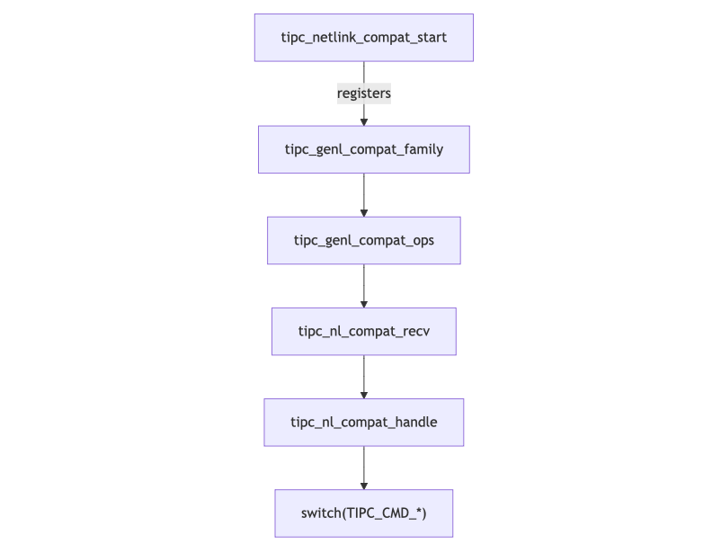

+++
title = 'Finding Bugs in Kernel. Part 2: Fuzzing the Actual Kernel'
date = 2024-11-17
draft = false
+++


In the [previous post](https://slavamoskvin.com/finding-bugs-in-kernel.-part-1-crashing-a-vulnerable-driver-with-syzkaller/), we had a crash course on **syzkaller**, one of the most renowned Linux kernel fuzzers. We explored how to set it up in a non-trivial configuration (on macOS, no less—but the general steps also apply to Linux, of course), compile the kernel with a vulnerable driver, and configure everything for syzkaller to crash it. Now it's time to target real-world code. So, what code?

syzkaller is constantly grinding on Google's servers, relentlessly transforming kilowatts of power into test cases and crashes. Unfortunately, I don’t have an unlimited supply of electricity or a server budget, for that matter. So, I need to be more deliberate in choosing my target.

Thankfully, Google hosts [syzbot](https://syzkaller.appspot.com/upstream), a syzkaller dashboard that displays the current fuzzing status, findings, and, most importantly, coverage for Linux subsystems.


We can use the latter to our advantage to find targets with less-than-ideal coverage. What qualifies as "less than ideal"? I don't know, but here goes nothing:

- **More than 0%**: If something isn’t covered at all, perhaps there’s a good reason for it—like the subsystem doesn’t directly consume user input or has hardware requirements that are hard to meet in a fuzzing environment.
- **Less than, say, 15–20%**: so it's not super explored as well.

## Candidates

With that in mind, I started browsing the [syzbot coverage heatmap](https://syzkaller.appspot.com/upstream/graph/coverage_subsystems_heatmap?period=month). The heatmap is a massive web page—128 MB of pure HTML. Parsing it to filter subsystems by coverage would have been a good idea, but it was already too late at night for good ideas. So, I went with the good old "read-it-to-the-end" approach.


Here are some of my notes:

- **jffs2 (~50%)**, **fs/jffs2 (0%)** - A suspicious combination. Perhaps there’s something worth exploring here?
- **bcachefs, fs/bcachefs - 10%**
- **net/atm - 1%**
- **net/dsa - 2%**
- **net/smc - 19%**
- **net/sunrpc - 13%**
- **nfs, fs/nfs - 37k blocks, 1%** - Why so low?
- **net/tipc - 49%** - High coverage, but still interesting due to a [recent UAF found in it](https://sam4k.com/zdi-24-821-a-remote-use-after-free-in-the-kernels-net-tipc/).
- **orangefs - 2%**
- Lots of other *fs subsystems are well under 10%.
- **fs/ubifs - 17k blocks, 0%!**
- **scsi? - 60k blocks, 7%** - Why so low? Is it hardware-dependent?
- **usb - 8%**, **usb-storage - 10%**
- **virt/drivers - 14%**
- **wireless/drivers - 1%** - This will surely require some hacks.

An interesting idea is to fuzz hardware-dependent functions like **MMC**, **PCI**, **NFC**, **pvrusb2**, **qat**, **RAID**, **RDMA**, etc.

In the end, I decided to try two network subsystems: [TIPC](https://docs.kernel.org/networking/tipc.html) (despite its high coverage, I was motivated by [the recentfindings from sam4k](https://sam4k.com/zdi-24-821-a-remote-use-after-free-in-the-kernels-net-tipc/)) and [SMC](https://www.ibm.com/docs/en/linux-on-systems?topic=n-smc-protocol-support-1).

Also, networking is much easier to fuzz: data flows nicely in and out through sockets, and everything can be configured with a few `ioctl` and `setsockopt` calls. Compare that to filesystems, where you have to handle binary blobs, mount and unmount them, or to other subsystems that might depend on specific hardware.

# Attack Surface

Now it’s time to read some kernel code to figure out the attack surface. I’ll focus exclusively on TIPC from here on, though SMC is practically the same deal. The TIPC code can be found under [net/tipc/](https://github.com/torvalds/linux/tree/master/net/tipc).

TIPC's Netlink legacy compatibility layer is initialized in the `tipc_netlink_compat_start` function. This function registers a Generic Netlink family, `tipc_genl_compat_family`, with the operations structure `tipc_genl_compat_ops`:

```C
static const struct genl_small_ops tipc_genl_compat_ops[] = {
	{
		.cmd		= TIPC_GENL_CMD,
		.validate = GENL_DONT_VALIDATE_STRICT | GENL_DONT_VALIDATE_DUMP,
		.doit		= tipc_nl_compat_recv,
	},
};
```

From the code, we can see that there’s essentially one operation callback: `tipc_nl_compat_recv`, which receives Netlink messages. The main dispatcher for these messages is the `tipc_nl_compat_handle` function, which uses a `switch` statement to handle `TIPC_CMD_*` commands.

From the code we can see that there's essentially one operation callback - `tipc_nl_compat_recv` that recieves netlink messages. And the main dispatcher of the messages is `tipc_nl_compat_handle` with a switch cases for `TIPC_CMD_*` commands.



That was the legacy Netlink support, but what about the newer version? We can observe a similar code flow in [net/tipc/netlink.c](https://github.com/torvalds/linux/blob/master/net/tipc/netlink.c). The `tipc_netlink_start` function registers the `tipc_genl_family` with an operations array, `tipc_genl_v2_ops`.

In this newer implementation, all operations are directly exposed rather than being hidden behind a single function:

```c
static const struct genl_ops tipc_genl_v2_ops[] = {
	{
		.cmd	= TIPC_NL_BEARER_DISABLE,
		.validate = GENL_DONT_VALIDATE_STRICT | GENL_DONT_VALIDATE_DUMP,
		.doit	= tipc_nl_bearer_disable,
	},
	{
		.cmd	= TIPC_NL_BEARER_ENABLE,
		.validate = GENL_DONT_VALIDATE_STRICT | GENL_DONT_VALIDATE_DUMP,
		.doit	= tipc_nl_bearer_enable,
	},
	{
		.cmd	= TIPC_NL_BEARER_GET,
		.validate = GENL_DONT_VALIDATE_STRICT | GENL_DONT_VALIDATE_DUMP,
		.doit	= tipc_nl_bearer_get,
		.dumpit	= tipc_nl_bearer_dump,
	},
	{
		.cmd	= TIPC_NL_BEARER_ADD,
		.validate = GENL_DONT_VALIDATE_STRICT | GENL_DONT_VALIDATE_DUMP,
		.doit	= tipc_nl_bearer_add,
	},
	{
		.cmd	= TIPC_NL_BEARER_SET,
		.validate = GENL_DONT_VALIDATE_STRICT | GENL_DONT_VALIDATE_DUMP,
		.doit	= tipc_nl_bearer_set,
	},
	{
		.cmd	= TIPC_NL_SOCK_GET,
		.validate = GENL_DONT_VALIDATE_STRICT | GENL_DONT_VALIDATE_DUMP,
		.start = tipc_dump_start,
		.dumpit	= tipc_nl_sk_dump,
		.done	= tipc_dump_done,
	},
	{
		.cmd	= TIPC_NL_PUBL_GET,
		.validate = GENL_DONT_VALIDATE_STRICT |
			    GENL_DONT_VALIDATE_DUMP_STRICT,
		.dumpit	= tipc_nl_publ_dump,
	},
	{
		.cmd	= TIPC_NL_LINK_GET,
		.validate = GENL_DONT_VALIDATE_STRICT,
		.doit   = tipc_nl_node_get_link,
		.dumpit	= tipc_nl_node_dump_link,
	},
	{
		.cmd	= TIPC_NL_LINK_SET,
		.validate = GENL_DONT_VALIDATE_STRICT | GENL_DONT_VALIDATE_DUMP,
		.doit	= tipc_nl_node_set_link,
	},
	{
		.cmd	= TIPC_NL_LINK_RESET_STATS,
		.validate = GENL_DONT_VALIDATE_STRICT | GENL_DONT_VALIDATE_DUMP,
		.doit   = tipc_nl_node_reset_link_stats,
	},
	{
		.cmd	= TIPC_NL_MEDIA_GET,
		.validate = GENL_DONT_VALIDATE_STRICT | GENL_DONT_VALIDATE_DUMP,
		.doit	= tipc_nl_media_get,
		.dumpit	= tipc_nl_media_dump,
	},
	{
		.cmd	= TIPC_NL_MEDIA_SET,
		.validate = GENL_DONT_VALIDATE_STRICT | GENL_DONT_VALIDATE_DUMP,
		.doit	= tipc_nl_media_set,
	},
	{
		.cmd	= TIPC_NL_NODE_GET,
		.validate = GENL_DONT_VALIDATE_STRICT | GENL_DONT_VALIDATE_DUMP,
		.dumpit	= tipc_nl_node_dump,
	},
	{
		.cmd	= TIPC_NL_NET_GET,
		.validate = GENL_DONT_VALIDATE_STRICT | GENL_DONT_VALIDATE_DUMP,
		.dumpit	= tipc_nl_net_dump,
	},
	{
		.cmd	= TIPC_NL_NET_SET,
		.validate = GENL_DONT_VALIDATE_STRICT | GENL_DONT_VALIDATE_DUMP,
		.doit	= tipc_nl_net_set,
	},
	{
		.cmd	= TIPC_NL_NAME_TABLE_GET,
		.validate = GENL_DONT_VALIDATE_STRICT | GENL_DONT_VALIDATE_DUMP,
		.dumpit	= tipc_nl_name_table_dump,
	},
	{
		.cmd	= TIPC_NL_MON_SET,
		.validate = GENL_DONT_VALIDATE_STRICT | GENL_DONT_VALIDATE_DUMP,
		.doit	= tipc_nl_node_set_monitor,
	},
	{
		.cmd	= TIPC_NL_MON_GET,
		.validate = GENL_DONT_VALIDATE_STRICT | GENL_DONT_VALIDATE_DUMP,
		.doit	= tipc_nl_node_get_monitor,
		.dumpit	= tipc_nl_node_dump_monitor,
	},
	{
		.cmd	= TIPC_NL_MON_PEER_GET,
		.validate = GENL_DONT_VALIDATE_STRICT |
			    GENL_DONT_VALIDATE_DUMP_STRICT,
		.dumpit	= tipc_nl_node_dump_monitor_peer,
	},
	{
		.cmd	= TIPC_NL_PEER_REMOVE,
		.validate = GENL_DONT_VALIDATE_STRICT | GENL_DONT_VALIDATE_DUMP,
		.doit	= tipc_nl_peer_rm,
	},
#ifdef CONFIG_TIPC_MEDIA_UDP
	{
		.cmd	= TIPC_NL_UDP_GET_REMOTEIP,
		.validate = GENL_DONT_VALIDATE_STRICT |
			    GENL_DONT_VALIDATE_DUMP_STRICT,
		.dumpit	= tipc_udp_nl_dump_remoteip,
	},
#endif
#ifdef CONFIG_TIPC_CRYPTO
	{
		.cmd	= TIPC_NL_KEY_SET,
		.validate = GENL_DONT_VALIDATE_STRICT | GENL_DONT_VALIDATE_DUMP,
		.doit	= tipc_nl_node_set_key,
	},
	{
		.cmd	= TIPC_NL_KEY_FLUSH,
		.validate = GENL_DONT_VALIDATE_STRICT | GENL_DONT_VALIDATE_DUMP,
		.doit	= tipc_nl_node_flush_key,
	},
#endif
	{
		.cmd	= TIPC_NL_ADDR_LEGACY_GET,
		.validate = GENL_DONT_VALIDATE_STRICT | GENL_DONT_VALIDATE_DUMP,
		.doit	= tipc_nl_net_addr_legacy_get,
	},
};
```

The control flow is as follows:


In [net/tipc/socket.c](https://github.com/torvalds/linux/blob/master/net/tipc/socket.c) we have protocol operations for different socket families (message, socket, stream). TIPC uses the same set of callbacks for all of them.

```c
static const struct proto_ops msg_ops = {
	.owner		= THIS_MODULE,
	.family		= AF_TIPC,
	.release	= tipc_release,
	.bind		= tipc_bind,
	.connect	= tipc_connect,
	.socketpair	= tipc_socketpair,
	.accept		= sock_no_accept,
	.getname	= tipc_getname,
	.poll		= tipc_poll,
	.ioctl		= tipc_ioctl,
	.listen		= sock_no_listen,
	.shutdown	= tipc_shutdown,
	.setsockopt	= tipc_setsockopt,
	.getsockopt	= tipc_getsockopt,
	.sendmsg	= tipc_sendmsg,
	.recvmsg	= tipc_recvmsg,
	.mmap		= sock_no_mmap,
};
```

These Netlink commands, along with the usual socket operations, constitute our attack surface.

As you remember, TIPC is already covered by syzkaller. Of course, some of the commands supported by the subsystem are already defined in the fuzzer’s files: [syzkaller/sys/linux/socket_tipc.txt](https://github.com/google/syzkaller/blob/master/sys/linux/socket_tipc.txt) and [syzkaller/sys/linux/socket_tipc_netlink.txt](https://github.com/google/syzkaller/blob/master/sys/linux/socket_tipc_netlink.txt).

I hoped to find discrepancies between the actual attack surface and the syscalls already defined in syzkaller. I did find one, but unfortunately, it was just a single syscall: `setsockopt` for the `TIPC_NODELAY` option.

Here’s how I described it:

```
setsockopt$TIPC_NODELAY(fd sock_tipc, level const[SOL_TIPC], opt const[TIPC_NODELAY], val ptr[in, int32], len bytesize[val])
```

Below are the syscalls I ended up enabling in my syzkaller configuration:

```json
"enable_syscalls": [
        "socket$tipc",
        "socketpair$tipc",
        "bind$tipc",
        "connect$tipc",
        "accept4$tipc",
        "getsockname$tipc",
        "getpeername$tipc",
        "sendmsg$tipc",
        "ioctl$SIOCGETLINKNAME",
        "ioctl$SIOCGETNODEID",
        "setsockopt$TIPC_IMPORTANCE",
        "setsockopt$TIPC_SRC_DROPPABLE",
        "setsockopt$TIPC_DEST_DROPPABLE",
        "setsockopt$TIPC_CONN_TIMEOUT",
        "setsockopt$TIPC_MCAST_BROADCAST",
        "setsockopt$TIPC_MCAST_REPLICAST",
        "setsockopt$TIPC_GROUP_LEAVE",
        "setsockopt$TIPC_GROUP_JOIN",
        "getsockopt$TIPC_IMPORTANCE",
        "getsockopt$TIPC_SRC_DROPPABLE",
        "getsockopt$TIPC_DEST_DROPPABLE",
        "getsockopt$TIPC_CONN_TIMEOUT",
        "getsockopt$TIPC_NODE_RECVQ_DEPTH",
        "getsockopt$TIPC_SOCK_RECVQ_DEPTH",
        "getsockopt$TIPC_GROUP_JOIN",
        "sendmsg$TIPC_CMD_SET_LINK_TOL",
        "sendmsg$TIPC_CMD_SET_LINK_PRI",
        "sendmsg$TIPC_CMD_SET_LINK_WINDOW",
        "sendmsg$TIPC_CMD_ENABLE_BEARER",
        "sendmsg$TIPC_CMD_GET_BEARER_NAMES",
        "sendmsg$TIPC_CMD_GET_MEDIA_NAMES",
        "sendmsg$TIPC_CMD_SHOW_PORTS",
        "sendmsg$TIPC_CMD_GET_REMOTE_MNG",
        "sendmsg$TIPC_CMD_GET_MAX_PORTS",
        "sendmsg$TIPC_CMD_GET_NETID",
        "sendmsg$TIPC_CMD_GET_NODES",
        "sendmsg$TIPC_CMD_GET_LINKS",
        "sendmsg$TIPC_CMD_SET_NODE_ADDR",
        "sendmsg$TIPC_CMD_SHOW_NAME_TABLE",
        "sendmsg$TIPC_CMD_SHOW_LINK_STATS",
        "sendmsg$TIPC_CMD_GET_MEDIA_NAMES",
        "sendmsg$TIPC_CMD_DISABLE_BEARER",
        "sendmsg$TIPC_CMD_RESET_LINK_STATS",
        "sendmsg$TIPC_CMD_SET_NETID",
        "socket$nl_generic",
        "syz_genetlink_get_family_id$tipc",
        "listen$tipc",
        "recvmsg$tipc",
        "shutdown$tipc",
        "close$tipc",
        "ppoll$tipc",
        "getsockopt$TIPC_SOCK_RECVQ_USED",
        "syz_genetlink_get_family_id$tipc2",
        "sendmsg$TIPC_NL_BEARER_DISABLE",
        "sendmsg$TIPC_NL_BEARER_ENABLE",
        "sendmsg$TIPC_NL_BEARER_GET",
        "sendmsg$TIPC_NL_BEARER_ADD",
        "sendmsg$TIPC_NL_BEARER_SET",
        "sendmsg$TIPC_NL_SOCK_GET",
        "sendmsg$TIPC_NL_PUBL_GET",
        "sendmsg$TIPC_NL_LINK_GET",
        "sendmsg$TIPC_NL_LINK_SET",
        "sendmsg$TIPC_NL_LINK_RESET_STATS",
        "sendmsg$TIPC_NL_MEDIA_GET",
        "sendmsg$TIPC_NL_MEDIA_SET",
        "sendmsg$TIPC_NL_NODE_GET",
        "sendmsg$TIPC_NL_NET_GET",
        "sendmsg$TIPC_NL_NET_SET",
        "sendmsg$TIPC_NL_NAME_TABLE_GET",
        "sendmsg$TIPC_NL_MON_SET",
        "sendmsg$TIPC_NL_MON_GET",
        "sendmsg$TIPC_NL_MON_PEER_GET",
        "sendmsg$TIPC_NL_PEER_REMOVE",
        "sendmsg$TIPC_NL_UDP_GET_REMOTEIP",
        "sendmsg$TIPC_NL_KEY_SET",
        "sendmsg$TIPC_NL_KEY_FLUSH"
      ]
```

# Performance Improvements

The default way of using syzkaller is with QEMU: syzkaller spins up and manages as many QEMU instances as you need. As you know, QEMU can operate in two modes: pure emulation ([TCG mode](https://www.qemu.org/docs/master/devel/index-tcg.html)) or [accelerated mode](https://www.qemu.org/docs/master/system/introduction.html), which leverages a hypervisor (like KVM on Linux) for better performance.

But macOS doesn’t have KVM. Thankfully, another accelerator is available: HVF (Apple's Hypervisor Framework). The only thing I had to do was change the QEMU options to make them compatible with HVF.

Anyone who has worked with complex QEMU VMs knows how "easy" and "intuitive" the configuration process is. So after some trial and error, I managed to adapt the default configuration:

```sh
$ qemu-system-aarch64 -m 2048 -smp 2 -chardev socket,id=SOCKSYZ,server=on,wait=off,host=localhost,port=42150 -mon chardev=SOCKSYZ,mode=control -display none -serial stdio -no-reboot -name VM-2 -device virtio-rng-pci -machine virt,virtualization=on,gic-version=max -cpu max,sve=off,pauth=off -accel tcg,thread=multi -device virtio-net-pci,netdev=net0 -netdev user,id=net0,restrict=on,hostfwd=tcp:127.0.0.1:18538-:22 -hda linux_kernel/rootfs.ext3 -snapshot -kernel linux_kernel/Image -append root=/dev/vda console=ttyAMA0 console=ttyAMA0 root=/dev/vda
```

to these parameters, which finally worked with HVF:

```sh 
$ qemu-system-aarch64 -m 2048 -smp 2 -chardev socket,id=SOCKSYZ,server=on,wait=off,host=localhost,port=63361 -mon chardev=SOCKSYZ,mode=control -display none -serial stdio -no-reboot -name VM-0 -device virtio-rng-pci -machine virt -accel hvf -device virtio-net-pci,netdev=net0 -netdev user,id=net0,restrict=on,hostfwd=tcp:127.0.0.1:32746-:22 -hda linux_kernel/rootfs.ext3 -snapshot -kernel linux_kernel/Image-6.10.8 -append "debug earlyprintk=serial slub_debug=UZ console=ttyAMA0 root=/dev/vda" -cpu cortex-a57
```

syzkaller allows you to specify additional QEMU options, but unfortunately, those platform-dependent options are hardcoded. Since, realistically, nobody but me is likely occupied with running syzkaller on macOS, I simply patched the options directly in the code and called it a day.

In the end, switching from TCG to HVF made the setup 3–5 times faster with the same configuration (number of VMs, processes, and RAM), so I was pretty happy with this optimization.

# Config and build

If you're new in this whole building the kernel thing, check out my [previous post](https://slavamoskvin.com/hunting-bugs-in-linux-kernel-with-kasan-how-to-use-it-whats-the-benefit/). Here, the proccess is the same, we just need to enable TIPC and SMC with a couple of dependencies so they're built into the kernel.

``` sh
$ make ARCH=arm64 defconfig
$ scripts/config -e KCOV -e KCOV_INSTRUMENT_ALL -e DEBUG_FS -e NET_9P -e NET_9P_VIRTIO -e TIPC -e KCOV_ENABLE_COMPARISONS -e KALLSYMS -e KALLSYMS_ALL -e DEBUG_INFO -e KASAN -d RANDOMIZE_BASE -d RANDOMIZE_MEMORY -e SMC -e INET -e INFINIBAND
```

Then, as usual:

```sh
$ make ARCH=arm64 oldconfig
$ make ARCH=arm64 -j $(nproc)
```

# Fuzzing

It’s always helps to lower your expectations when fuzzing the kernel. So, as usual, I just started the campaign, made sure it was running smoothly, and went back to sleep. And yes, let me emphasize that under no circumstances did I check on the fuzzer in the middle of the night 😅.

The next morning, I was greeted with this:


As you can see, those "KASAN: slab-use-after-free" messages look pretty promising. Nice!

Well, not so fast. Automatic reproduction failed, so I started by digging into the crash logs. The call trace already looked suspicious because none of the listed functions were explicitly part of TIPC.


After reading [several articles](https://marliere.net/posts/1/) and [docs](https://github.com/google/syzkaller/blob/master/docs/reproducing_crashes.md) on reproducing syzkaller crashes, I managed to  get my head around it. Unfortunately, the bugs just refused to trigger.

You’ll notice there are plenty of bug reports on the [syzbot page](https://syzkaller.appspot.com/upstream) marked as `inconclusive`. I guess I can classify my crashes the same way.


Oh well, time to move on to the next target. But that’s a story for another time.

Thanks for reading, and let’s stay in touch!

If you want to hear more from me, consider subscribing to my [Telegram](https://t.me/vmcybersec) or [WhatsApp](https://www.whatsapp.com/channel/0029VaLUxTc1t90agPp1nt2R) channels.
